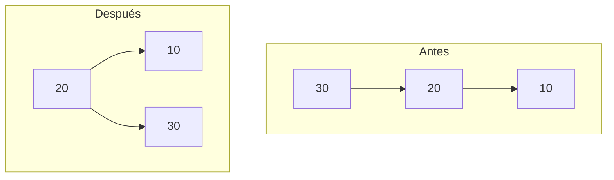

# Rotaciones simples LL y RR

[Inicio](../../README.md) · [Unidad](../../unidad1/README.md) · [Anterior](../../unidad1/02-alturas-y-factor-avl/README.md)

## Objetivo

Explicar cómo una rotación conserva el orden de búsqueda y repara el desequilibrio de una rama exterior.

## Desarrollo conceptual

Una rotación cambia referencias locales sin cambiar el conjunto de claves ni el orden del recorrido inorden. En una rotación a la derecha, p tiene un hijo izquierdo q. q pasa a ocupar la posición de p; p se convierte en su hijo derecho y el antiguo hijo derecho de q pasa a ser el hijo izquierdo de p. Ese subárbol intermedio contiene claves mayores que q y menores que p, por lo que su nueva ubicación conserva el orden de búsqueda.

El caso LL aparece cuando la altura crece hacia la izquierda del hijo izquierdo. Se repara con una rotación a la derecha. El caso RR es simétrico y usa una rotación a la izquierda. Los nombres LL y RR describen el camino del desequilibrio, no el sentido de la rotación.

Después de cambiar referencias se actualiza primero la altura de la antigua raíz y después la de la nueva raíz. La nueva altura depende de la antigua raíz ya corregida. La función devuelve la nueva raíz del subárbol; quien la llama debe asignarla al enlace correspondiente. Olvidar esa asignación pierde la reparación.

En eliminación también puede requerirse una rotación simple cuando el hijo tiene factor cero. No se debe restringir la reparación a factores del hijo iguales a +1 o -1, porque esos criterios describen solo algunos casos de inserción.

## Caso paso a paso

Insertar 30, 20, 10 produce el caso LL antes de reparar: 30→20→10. La rotación deja 20 como raíz, con hijos 10 y 30. Insertar 10, 20, 30 produce RR y termina con el mismo contenido y altura 2.

Antes de ejecutar, escribe el resultado que esperas. Identifica los datos de entrada, la operación principal y la propiedad que debe conservarse. Después compara tu predicción con la salida y explica cualquier diferencia mediante una operación concreta.

### Cambio local en el caso LL



En un caso grande, el antiguo hijo derecho de 20 pasa a ser hijo izquierdo de 30. Ese traslado mantiene el intervalo de claves entre 20 y 30.

## Ejemplo ejecutable

El [programa completo](Main.java) utiliza la [implementación compartida de AVL](../../src/curso/AVL.java). Abre ambos archivos: Main presenta el caso y la clase compartida contiene el algoritmo que debes estudiar. Los métodos no requieren servicios externos.

```java
import curso.*;
import java.util.*;
import java.io.*;
public class Main {
    public static void main(String[] args) throws Exception {
        for(int[] secuencia:new int[][]{
            {
                30,20,10
            },{
                10,20,30
            }
        }){
            AVL a=new AVL();
            for(int k:secuencia)a.insertar(k);
            a.verificar();
            System.out.println(a.orden()+"; altura="+a.altura());
        }
    }
}
```

Desde la carpeta raíz del repositorio, en Ubuntu o macOS:

```bash
python3 scripts/ejecutar.py unidad1/03-rotaciones-simples
```

En PowerShell de Windows:

```powershell
py -3 scripts/ejecutar.py unidad1/03-rotaciones-simples
```

El ejecutor compila solo este Main y las clases compartidas en una carpeta temporal. No mezcles los Main de otras lecciones en una sola compilación. También puedes usar [compilación manual](../../docs/ambiente-y-herramientas.md).

### Salida esperada

```text
[10, 20, 30]; altura=2
[10, 20, 30]; altura=2
```


## Costos y límites

Una rotación: O(1) tiempo y espacio auxiliar. Encontrar el punto de reparación durante una operación: O(log n).

La salida impresa y las copias de listas tienen su propio costo. Cuando evalúes el algoritmo, distingue la operación central de la preparación del caso, el recorrido para mostrar resultados y las comprobaciones de prueba.

## Errores frecuentes

Llamar LL a una rotación izquierda; perder el subárbol intermedio; actualizar alturas en el orden inverso.

Ante una discrepancia, reduce la entrada hasta obtener un caso pequeño que la reproduzca. Revisa primero el contrato y después la primera operación que rompe una invariante. Un mensaje de error debe ayudar a reconocer una entrada inválida; no debe transformarla silenciosamente en un resultado válido.

## Ejercicio resuelto

Repite con 50, 40, 30 y con 30, 40, 50. Indica la nueva raíz y el inorden.

<details>
<summary>Ver una solución razonada</summary>

En ambas secuencias la raíz final es 40 y el inorden [30, 40, 50]. Las referencias cambian, pero no las relaciones menor/mayor entre claves.

</details>

## Práctica y comprobación

1. Ejecuta el caso original y guarda su resultado.
2. Realiza el cambio propuesto en el ejercicio y contrasta con tu predicción.
3. Agrega un caso límite pertinente (vacío, ausencia, empate, extremo numérico o entrada inválida). Explica cuál aplica al contrato de esta lección.
4. Describe una propiedad comprobable y por qué una salida aparentemente correcta podría no ser suficiente.

Entrega la entrada utilizada, el resultado esperado y observado, y una explicación del costo de la operación principal. Si cambias un algoritmo, ejecuta las [pruebas del curso](../../tests/README.md).

## Preguntas de comprensión

- ¿Qué precondición necesita la operación y qué resultado promete?
- ¿Qué dato se modifica y qué propiedad debe conservarse?
- ¿Qué parte de la implementación explica el costo indicado?

[Anterior](../../unidad1/02-alturas-y-factor-avl/README.md) · [Índice de la unidad](../../unidad1/README.md) · [Siguiente recurso](../../unidad1/04-rotaciones-dobles/README.md)
