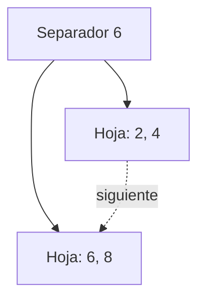

# Árbol B+: separadores y registros en hojas

[Inicio](../../README.md) · [Unidad](../../unidad1/README.md) · [Anterior](../../unidad1/11-eliminacion-b/README.md)

## Objetivo

Distinguir claves separadoras de registros y seguir una división que conserva hojas enlazadas.

## Desarrollo conceptual

En la variante B+ del curso, los registros clave–valor se almacenan únicamente en las hojas. Los nodos internos contienen referencias a hijos y claves separadoras para decidir el descenso. Un separador es el mínimo del hijo que está a su derecha. Por eso una clave puede aparecer como separador y también en una hoja, sin representar dos registros distintos.

Definimos M como el máximo de claves de un nodo. Una hoja no raíz contiene al menos ceil(M/2) registros. Un nodo interno no raíz tiene entre ceil((M+1)/2) y M+1 hijos. Todas las hojas tienen la misma profundidad. La raíz tiene las excepciones necesarias para iniciar el árbol y contraerlo.

Al dividir una hoja desbordada, se reparte su contenido y se enlazan ambas hojas. La primera clave de la hoja derecha sirve como separador en el padre, pero permanece en la hoja. Al dividir un nodo interno se reparten los hijos y se reconstruyen los separadores a partir de sus mínimos. La implementación conserva ese mínimo en cada nodo para evitar recorrer nuevamente su rama izquierda.

poner actualiza el valor cuando la clave ya existe; buscar devuelve null cuando está ausente. Se prohíben valores null para que esa señal no sea ambigua. Es un índice en memoria con fines de estudio: no simula páginas de disco ni ofrece transacciones.

## Caso paso a paso

Con M=3, inserta claves 8, 2, 6, 4, 10 y 12. Una hoja desbordada de cuatro registros se divide en dos de dos registros. Poner nuevamente 6 cambia su valor, conservando una única clave 6 en las hojas.

Antes de ejecutar, escribe el resultado que esperas. Identifica los datos de entrada, la operación principal y la propiedad que debe conservarse. Después compara tu predicción con la salida y explica cualquier diferencia mediante una operación concreta.

### Separadores y hojas enlazadas



La clave 6 sirve para elegir la hoja derecha y permanece allí como registro. Para un rango, se baja por los separadores y luego se siguen los enlaces entre hojas.

## Ejemplo ejecutable

El [programa completo](Main.java) utiliza la [implementación compartida de ArbolBMas](../../src/curso/ArbolBMas.java). Abre ambos archivos: Main presenta el caso y la clase compartida contiene el algoritmo que debes estudiar. Los métodos no requieren servicios externos.

```java
import curso.*;
import java.util.*;
import java.io.*;
public class Main {
    public static void main(String[] args) throws Exception {
        ArbolBMas b=new ArbolBMas(3);
        for(int k:new int[]{
            8,2,6,4,10,12
        })b.poner(k,"v"+k);
        b.poner(6,"seis");
        b.verificar();
        System.out.println(b.buscar(6));
        System.out.println(b.buscar(5));
        System.out.println(b.rango(0,20));
    }
}
```

Desde la carpeta raíz del repositorio, en Ubuntu o macOS:

```bash
python3 scripts/ejecutar.py unidad1/12-indices-b-mas
```

En PowerShell de Windows:

```powershell
py -3 scripts/ejecutar.py unidad1/12-indices-b-mas
```

El ejecutor compila solo este Main y las clases compartidas en una carpeta temporal. No mezcles los Main de otras lecciones en una sola compilación. También puedes usar [compilación manual](../../docs/ambiente-y-herramientas.md).

### Salida esperada

```text
seis
null
{2=v2, 4=v4, 6=seis, 8=v8, 10=v10, 12=v12}
```


## Costos y límites

Búsqueda e inserción O(M log_M n) con nodos en ArrayList; O(log n) para M fijo. Espacio total O(n), más valores de texto.

La salida impresa y las copias de listas tienen su propio costo. Cuando evalúes el algoritmo, distingue la operación central de la preparación del caso, el recorrido para mostrar resultados y las comprobaciones de prueba.

## Errores frecuentes

Eliminar de la hoja el separador copiado; buscar solo registros internos; interpretar null como un valor permitido.

Ante una discrepancia, reduce la entrada hasta obtener un caso pequeño que la reproduzca. Revisa primero el contrato y después la primera operación que rompe una invariante. Un mensaje de error debe ayudar a reconocer una entrada inválida; no debe transformarla silenciosamente en un resultado válido.

## Ejercicio resuelto

Actualiza 6 a seis y busca 5. Explica por qué un separador puede repetirse en la hoja.

<details>
<summary>Ver una solución razonada</summary>

buscar(6) devuelve seis y buscar(5) devuelve null. El separador dirige la búsqueda; la entrada en la hoja es el registro real. No es un duplicado del mapa.

</details>

## Práctica y comprobación

1. Ejecuta el caso original y guarda su resultado.
2. Realiza el cambio propuesto en el ejercicio y contrasta con tu predicción.
3. Agrega un caso límite pertinente (vacío, ausencia, empate, extremo numérico o entrada inválida). Explica cuál aplica al contrato de esta lección.
4. Describe una propiedad comprobable y por qué una salida aparentemente correcta podría no ser suficiente.

Entrega la entrada utilizada, el resultado esperado y observado, y una explicación del costo de la operación principal. Si cambias un algoritmo, ejecuta las [pruebas del curso](../../tests/README.md).

## Preguntas de comprensión

- ¿Qué precondición necesita la operación y qué resultado promete?
- ¿Qué dato se modifica y qué propiedad debe conservarse?
- ¿Qué parte de la implementación explica el costo indicado?

[Anterior](../../unidad1/11-eliminacion-b/README.md) · [Índice de la unidad](../../unidad1/README.md) · [Siguiente recurso](../../unidad1/13-rangos-y-eliminacion-b-mas/README.md)
